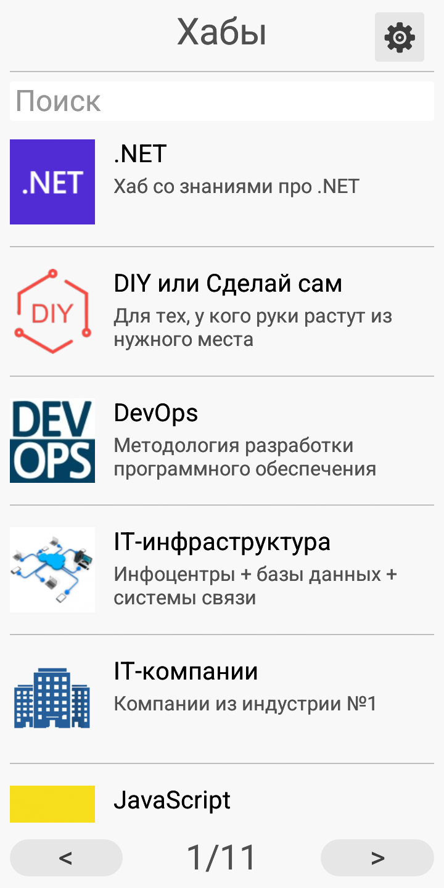
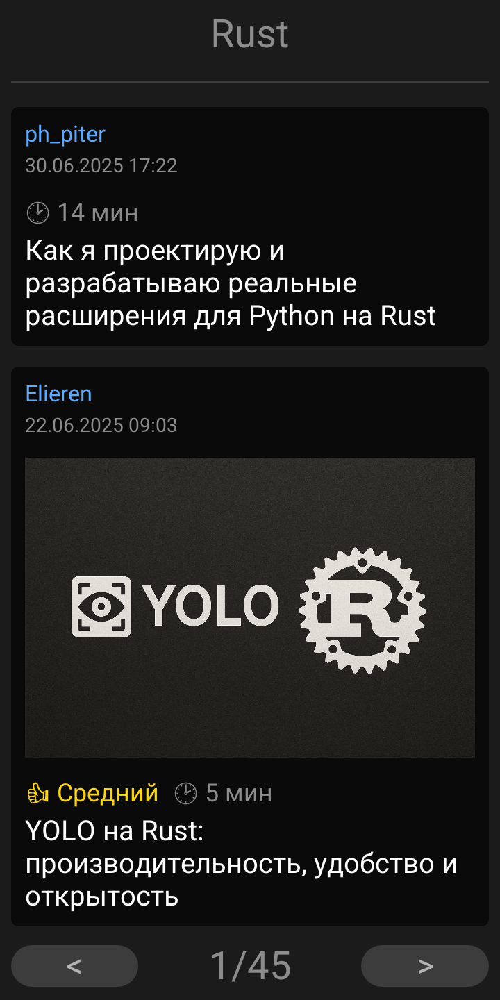

# Haboost

Haboost - это ограниченный неофициальный клиент ресурса [Habr](https://habr.com).

Приложение написано в качестве демонстрации возможности разработки под ОС Аврора (и, возможно, Sailfish OS) с использованием языка Rust и библиотеки [egui](https://github.com/emilk/egui).

## Скриншоты с устройства AYYA T1

<div align="center">
    
    
    
    
</div>

## Roadmap

- [x] Поиск по хабам
- [ ] Чтение статей
  - [x] Заголовки
  - [x] Обычный текст
  - [x] Изображения
    - [x] Отображение
    - [x] Возможность масштабирования
  - [x] Ссылки
    - [x] Отображение
    - [x] Возможность перехода по ссылке
  - [x] Курсив
  - [x] Жирный шрифт
  - [ ] Списки
  - [x] Цитаты
  - [x] Код
  - [ ] Спойлеры
  - [ ] Таблицы
  - [ ] Другие тэги, про которые я забыл
- [ ] Локальное хранение статей
- [ ] Копирование выделенного текста
- [ ] Поиск по статьям
- [ ] Настройки
  - [x] Коэффициент масштабирования
  - [x] Выбор темы

## Особенности сборки

Для сборки под устройство с ОС Аврора необходимо в файле [Cargo.toml](Cargo.toml) прописать патчи на библиотеки `winit` и `glutin`, без них приложение не сможет запуститься.

```toml
[patch.crates-io]
winit = { git = "https://github.com/lmaxyz/winit", branch = "aurora" }
glutin = { git = "https://github.com/lmaxyz/glutin", branch = "aurora_device_fix" }
```

Также я для сборки использую [cross](https://github.com/cross-rs/cross), поэтому рекомендую его установить, если хотите использовать для сборки скрипты из этого репозитория.
